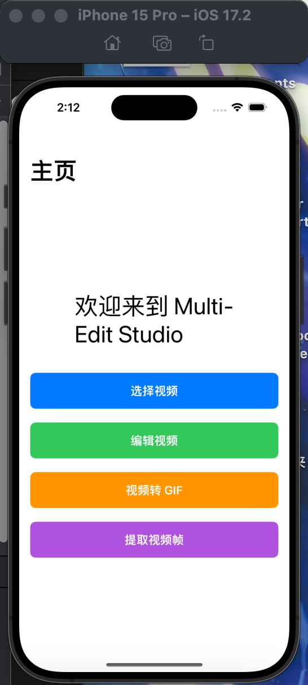
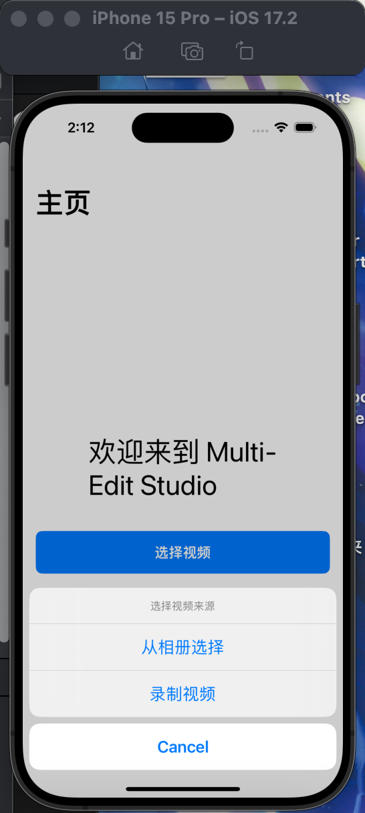
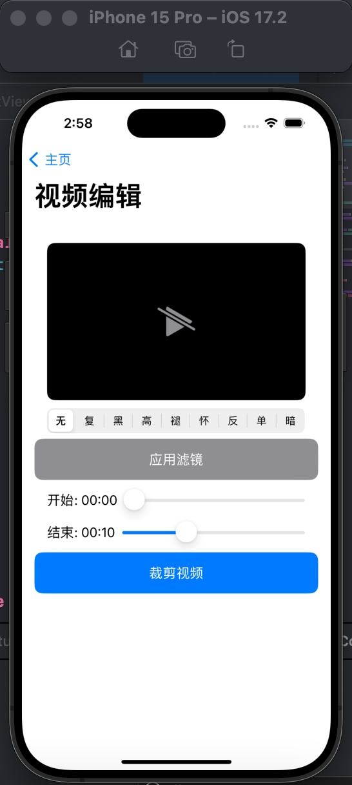
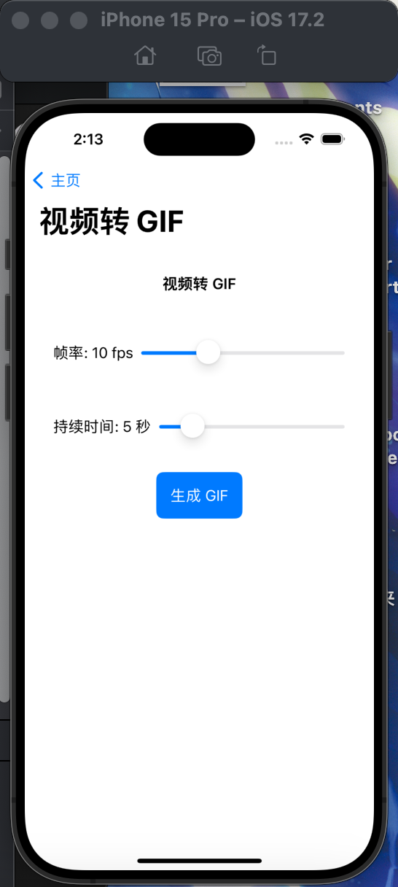
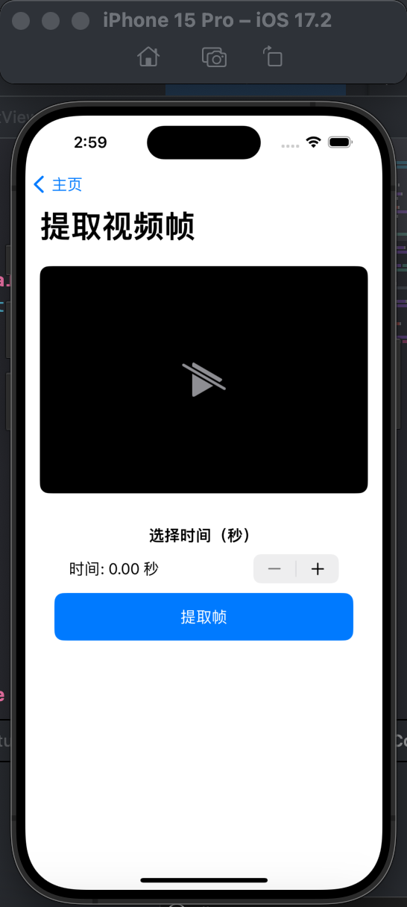
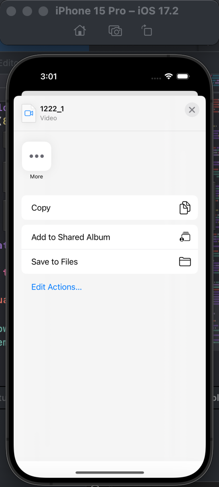

# MultiEditStudio 说明文档

本仓库为2024年同济大学移动应用开发期末项目的仓库。

仓库链接：https://github.com/lostbefore/MultiEditStudio

## 1. 项目的动机

### 1.1 项目背景

在当前数字化时代，视频已成为日常交流、教育、娱乐以及商业推广的重要媒介。然而，许多视频编辑软件因复杂的操作和高昂的费用让普通用户望而却步，尤其是需要快速进行简单剪辑或滤镜应用的用户。

### 1.2 项目目标

MultiEditStudio 的目标是为用户提供一个简洁、高效且易于操作的视频编辑工具，专注于满足以下需求：

- **解决的问题**：降低视频编辑的技术门槛，提供快速剪辑和滤镜应用等功能，避免使用繁琐的大型软件。
- **主要使用者**：面向普通用户、内容创作者（如短视频制作者）以及需要快速处理视频的中小型企业。
- **用户的好处**：
  - 提供简单直观的用户界面，快速完成基本的视频处理。
  - 集成多功能模块（如帧提取、滤镜应用和视频分享），满足多样化需求。
  - 通过本地处理和优化算法，保证高性能编辑体验。

------

## 2. 项目的竞品情况

### 2.1 现有类似项目

目前市场上有多个功能类似的视频编辑工具，以下为三大竞品及其 SWOT 分析：

#### 竞品 1：**Adobe Premiere Rush**

- **优势（Strengths）：**
  - 强大的品牌效应和功能丰富的编辑工具。
  - 跨平台支持（iOS、Android、Windows 和 macOS）。
  - 提供云同步功能，方便多设备协作。
- **劣势（Weaknesses）：**
  - 对新用户较为复杂。
  - 需要订阅服务，成本较高。
- **机会（Opportunities）：**
  - 短视频行业的快速增长带来更大的市场需求。
- **威胁（Threats）：**
  - 与众多免费或低成本工具的竞争。

#### 竞品 2：**iMovie**

- **优势（Strengths）：**
  - Apple 原生支持，优化性能优秀。
  - 界面友好，适合新手使用。
  - 免费提供。
- **劣势（Weaknesses）：**
  - 功能相对有限，无法满足复杂需求。
  - 仅支持 Apple 生态系统。
- **机会（Opportunities）：**
  - 简单高效的编辑工具仍有广泛用户群体。
- **威胁（Threats）：**
  - 与其他跨平台工具的竞争。

#### 竞品 3：**CapCut**

- **优势（Strengths）：**
  - 提供多样化的滤镜、特效和音频编辑功能。
  - 免费使用，支持社交媒体直接导出。
  - 跨平台支持。
- **劣势（Weaknesses）：**
  - 对本地性能要求较高，低性能设备可能体验不佳。
  - 滤镜和特效的定制化程度有限。
- **机会（Opportunities）：**
  - 依赖短视频平台的发展，吸引大量用户。
- **威胁（Threats）：**
  - 与其他功能相近的工具（如 VN、InShot）竞争激烈。

### 2.2 项目与竞品的区别

- **核心差异化：**
  1. MultiEditStudio 专注于快速完成核心功能（剪辑、滤镜、帧提取和分享），操作简单而高效。
  2. 提供直观的本地化界面，更加符合普通用户的使用习惯。
  3. 结合 AI 优化（未来版本规划），提升滤镜推荐和操作效率。
- **用户友好性**：相比 Adobe Premiere Rush 更易上手，相比 CapCut 提供更简洁的功能界面。

------

## 3. 项目的功能

### 3.1 系统功能介绍

MultiEditStudio 提供以下功能模块：

1. **视频播放与编辑**：实时播放视频，支持起始与结束时间的裁剪。
2. **滤镜应用**：内置多种常用滤镜（如复古、黑白、褪色等）。
3. **帧提取**：选择任意时间点，提取并保存视频帧。
4. **导出与分享**：支持将编辑后的内容导出到本地或直接分享至社交媒体。

### 3.2 系统主要界面

**主界面**

**选择视频**

**编辑视频**

**视频转GIF**

**提取帧**

**分享**

### 3.3 技术解决方案

- **视频编辑**：基于 AVFoundation 框架实现视频的加载、剪辑和导出。
- **滤镜应用**：使用 CoreImage 实现实时滤镜效果。
- **帧提取**：通过 AVAssetImageGenerator 提取指定时间点的帧。
- **分享功能**：利用系统的 UIActivityViewController 提供分享功能。

### 3.4 涉及相关技术的分析

- **AVFoundation**：高性能的视频处理框架，提供精准的时间操作和多格式支持。
- **CoreImage**：轻量级且强大的图像处理框架，适合实时滤镜应用。
- **SwiftUI**：现代化的用户界面框架，减少代码复杂度，提升开发效率。

### 3.5 技术特色和技术壁垒

- **技术特色：**
  - 实现了基于本地化的滤镜推荐和高效视频裁剪。
  - 高度优化的视频处理流程，减少延迟。
- **技术壁垒：**
  - 需要深入理解 AVFoundation 和 CoreImage 的高级功能。
  - 滤镜效果和视频性能之间的平衡。
  - 多平台兼容性扩展（未来版本规划）。

